# Stickers
Collection of stickers about Lisp in general and as well Common Lisp

</a> 
</a>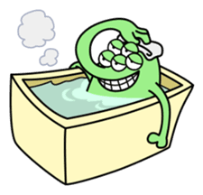 
</a> 
</a> 
</a> 
</a> 
</a> 
</a> 
</a> 
</a>
</a>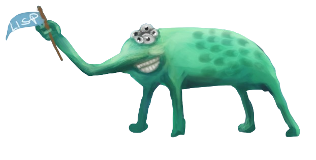 
</a> 
</a> 
</a> 
</a> 
</a>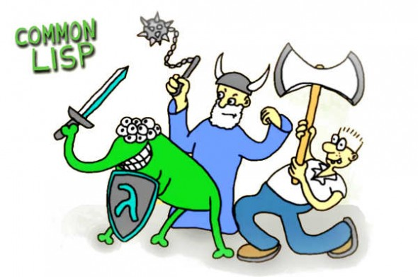 
</a>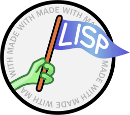 
</a>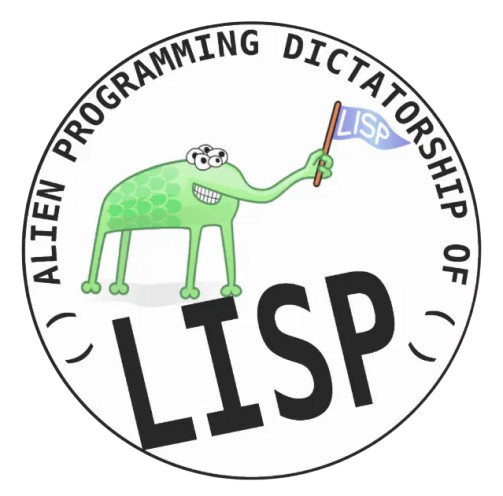 
</a>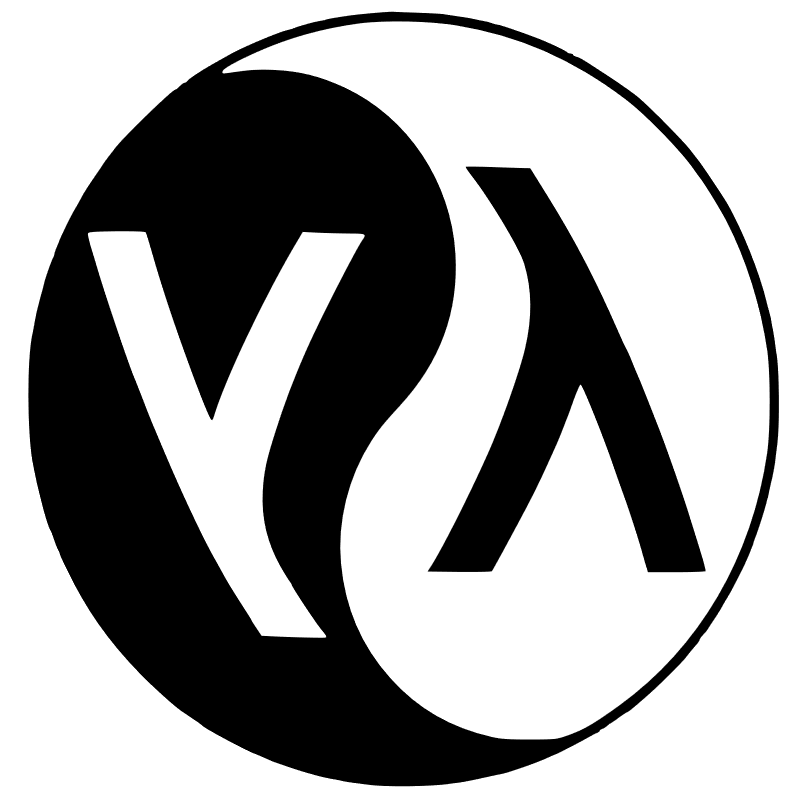 
</a>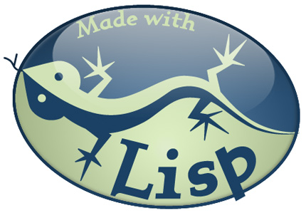 
</a>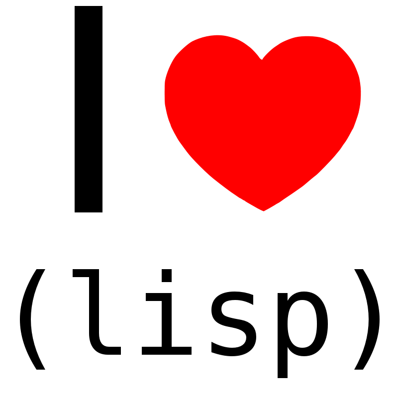 
</a>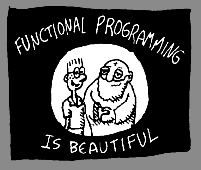 
</a> 
</a>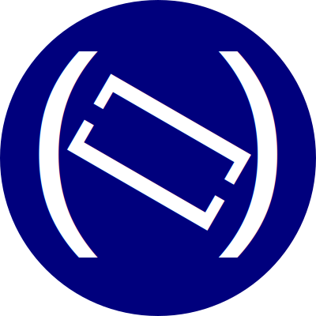 
</a> 
</a>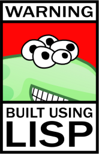 
</a>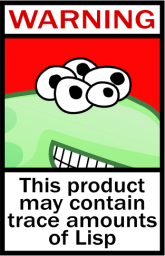 
</a>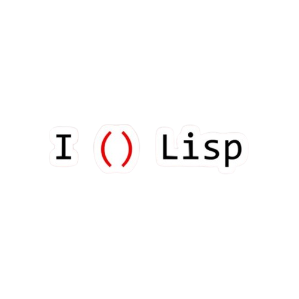 
</a>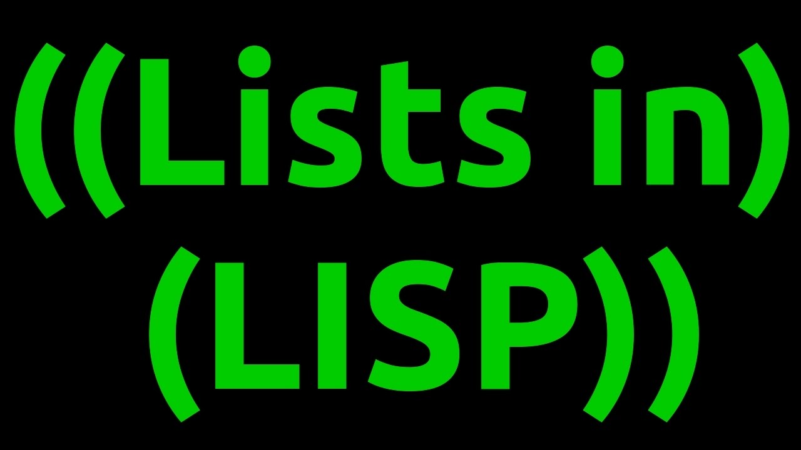 
</a>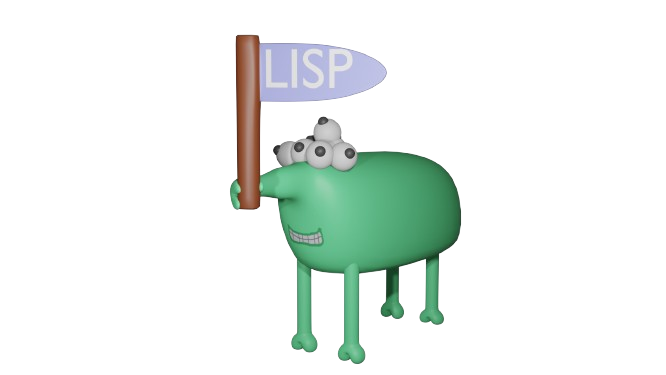
</a>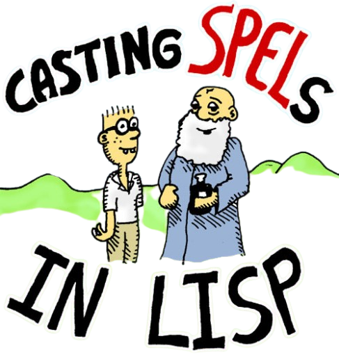 
</a> 
</a>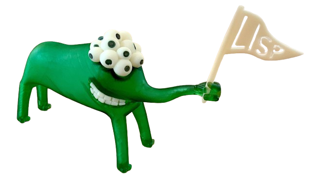 
</a> 
</a>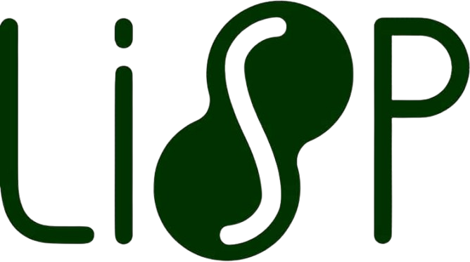 
</a>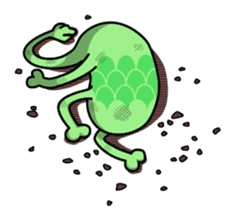 
</a> 
</a>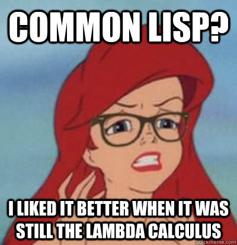 
</a>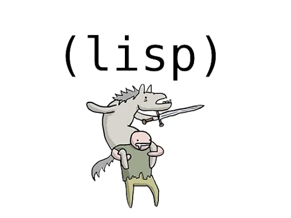 
</a> 
 
 
</a>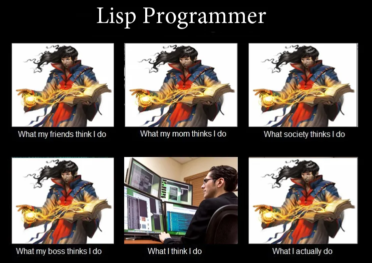 
</a> 
 
 
</a> 
</a>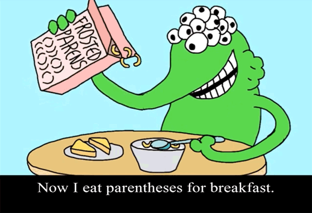 
 
 
</a>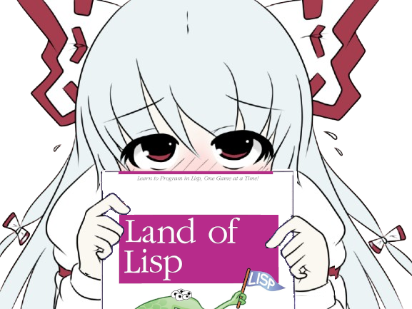 
</a>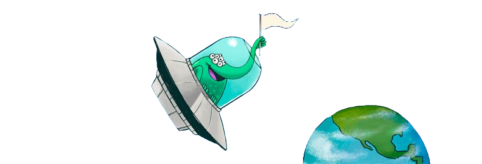 
 
</a>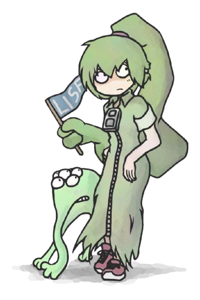 
</a>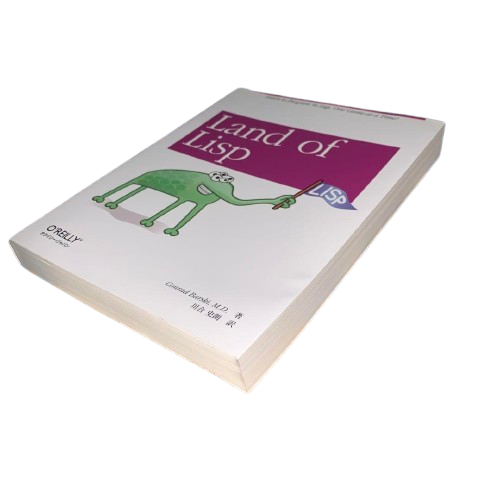 
</a> 
</a>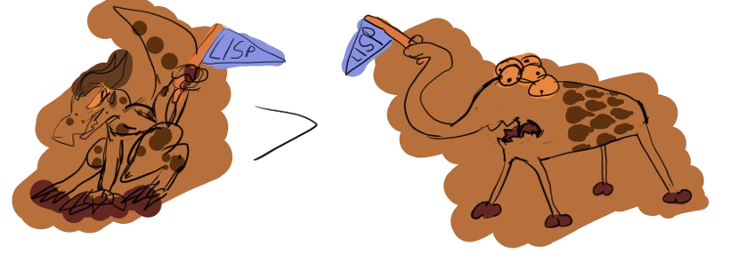 

